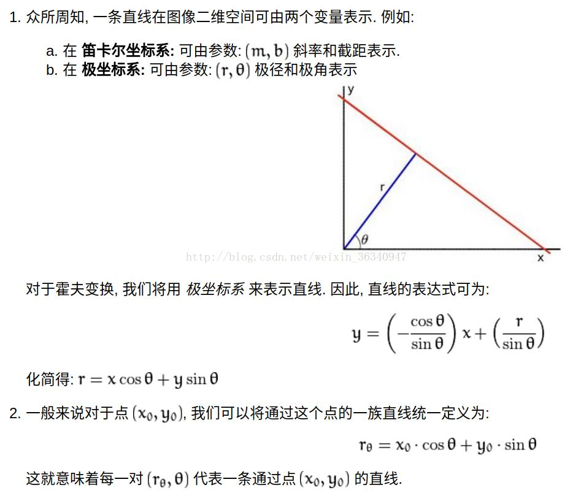

## 盲人智能辅助系统
### 聚焦功能

在室内WIFI环境下，为盲人提供语音听书功能以及紧急报警功能。

---

### 关键算法

+ 文字识别 

  + 调用api，初步验证api的准确率
  + 验证高准确率需要的相机分辨率 
    
+ 语音唤醒
  + 如何设计一套有效简洁的交互系统？
  + 调用api
  + 或是自己通过针对几个简单的命令实现定向的语音识别

+ 图书校正
  + 在盲人没有摆正图书的情况下，提示图书的位置
  + 初步思路：检测出图书的轮廓，然后通过轮廓中心的位置，提示盲人移动图书

+ 目标检测（待做）
  + 调用api，初步验证api对于常见物品的准确率
  + 图片中物体位置转换为世界坐标系的三维位置的方法

+ 云端服务
  + 待定
  + 目前可选方案
    + 摔倒检测，通过小程序/app传到紧急联系人手机上
    + 云端图书资源，通过将已读过的图书信息传入云端，在下次阅读时可以提示进度

---
## 硬件设备

+ 树莓派4B
+ 高清摄像头（USB接口）
+ 三轴加速度计？
+ 麦克风
+ 耳机（有线or无线）
+ 按键
+ ...

---
## 分工
郭艺君：
  + 【5】智能服务设计 
  + 【2】关键算法论证有关文字识别的部分

何妍：
  + 【1】系统规范 
  + 【6】工业设计 
  + 【7】系统调试/测试方案 
  + 【2】关键算法论证有关语音的部分

刘恩嵩：
  + 【4】软件详细设计  
  + 【2】关键算法论证有关图书校正的部分

注：
+ 【2】总体方案最后整合的时候我来加上，其中关键算法论证计算部分进行再分工 
+ 【3】硬件详细设计需要大家一起再决定在哪一个部分加入硬件

---
### 图书校正
+ 透视校正
  + 首先需要的就是找到这张纸的轮廓，然后按照从大小的顺序排列，排好之后，找出最大的轮廓，如果判定找到的最大轮廓有四个点，则可以判定我们找到这张纸，然后用四点透视变换获得纸张的俯视图。

+ 霍夫线变换原理
  + 直线在图像二维空间由两个变量表示，例如
    + 在 **笛卡尔坐标系**由$(m,b)$斜率和截距表示
    + 在 **极坐标系**由$(\rho,\theta)$表示
  + 对于过$(x_0,y_0)$的直线在极坐标下可以表示为
    + $\rho_{\theta}=x_0cos\theta+y_0sin\theta$
  + **一条直线能够在$r-\theta$平面寻找交于一点的曲线数量来检测，越多曲线交于一点也就意味着这个交点表示的直线由更多的点组成，我们可以设置直线上的点的阈值来定义多少条曲线交于一点，我们才认为检测到一条直线**

+ 对于当前视野内图书不完整的问题我们也可以通过霍夫线检测来实现
  + 当直线的大量端点位于图片边界时，我们合理的认为这些直线来源是文字，并且这些文字并不完整，提示使用者移动图书来实现更好的读取