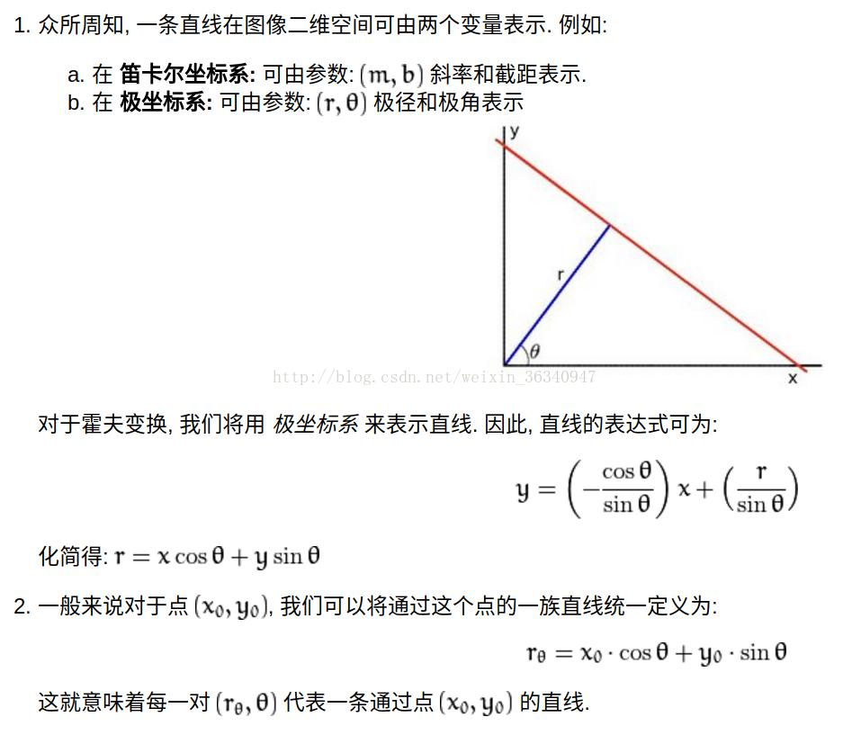
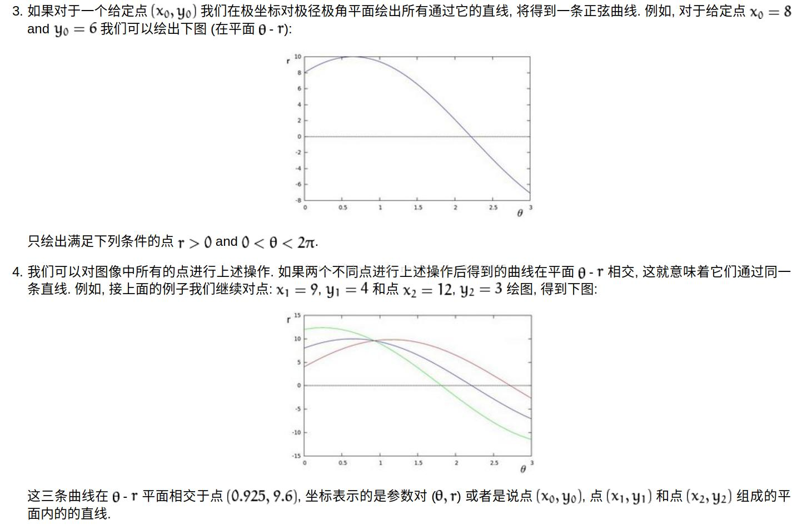
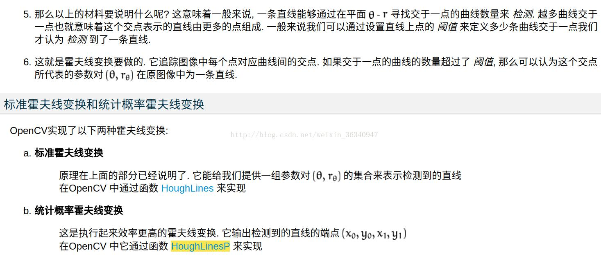

### 图书校正
+ 透视校正
  + 针对问题：照片角度不正
  + 首先需要的就是找到这张纸的轮廓，然后按照从大小的顺序排列，排好之后，找出最大的轮廓，如果判定找到的最大轮廓有四个点，则可以判定我们找到这张纸，然后用四点透视变换获得纸张的俯视图。

+ 霍夫线变换原理
  + 直线在图像二维空间由两个变量表示，例如
    + 在 **笛卡尔坐标系**由$(m,b)$斜率和截距表示
    + 在 **极坐标系**由$(\rho,\theta)$表示
  + 对于过$(x_0,y_0)$的直线在极坐标下可以表示为
    + $\rho_{\theta}=x_0cos\theta+y_0sin\theta$
  + **一条直线能够在$r-\theta$平面寻找交于一点的曲线数量来检测，越多曲线交于一点也就意味着这个交点表示的直线由更多的点组成，我们可以设置直线上的点的阈值来定义多少条曲线交于一点，我们才认为检测到一条直线**

+ 提示图书移动
  + 针对问题：当前视野内图书显示不全，提示移动以获得更全的视野
  + 方案一：Opencv操作实现
    + 灰度化处理$\rightarrow$过卷积核$\rightarrow$最大池化操作$\rightarrow$二值化处理$\rightarrow$判断某一边上为255的点是否达到阈值$\rightarrow$提示移动方向

  + 方案二：调用API实现
    + 返回文字矩形顶点位置，通过顶点是否大量位于图片某一边来判断是否完整