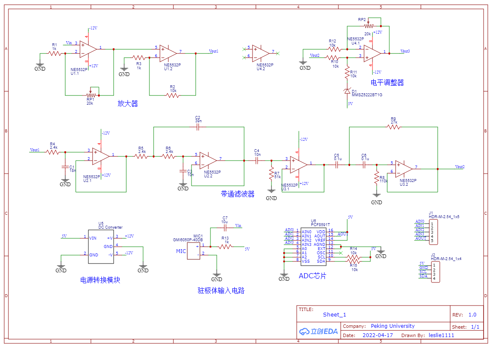
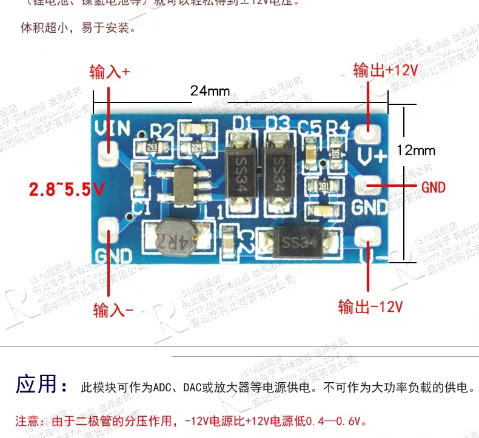

### 硬件电路基本原理图

### 目前问题
1. 数字地与模拟地隔离问题
   + AGND与DGND
2. 电源转换模块没有详细原理图问题
   + 
3. 电源去耦电容作用
4. 运放消除偏置电流的电阻
5. 滑动变阻器位置的选择
6. PCF8591芯片
   + 采样频率由总线速率决定
   + 量化精度8Bit
   + I2C与CPU通信
### PCM编码
PCM 即脉冲编码调制 (Pulse Code Modulation)。在PCM 过程中，将输入的模拟信号进行采样、量化和编码，用二进制进行编码的数来代表模拟信号的幅度 ；接收端再将这些编码还原为原来的模拟信号。即数字音频的 A/D 转换包括三个过程 ：采样，量化，编码。